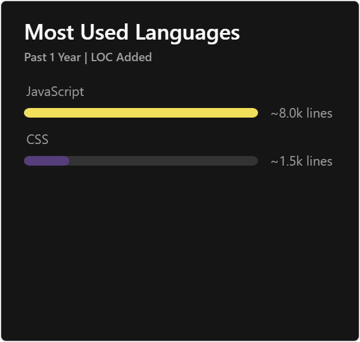

# Overview

## - 👋 Hi, I’m Suria Sultana
- 👀 I’m interested in Web development
- 🌱 I’m currently learning Next.js
- 💞️ I’m looking to collaborate on New Projects
- 📫 How to reach me  => suraiyasultana826@gmail.com

## My Skills

<!---
suraiyasultana826/suraiyasultana826 is a ✨ special ✨ repository because its `README.md` (this file) appears on your GitHub profile.
You can click the Preview link to take a look at your changes.
--->
